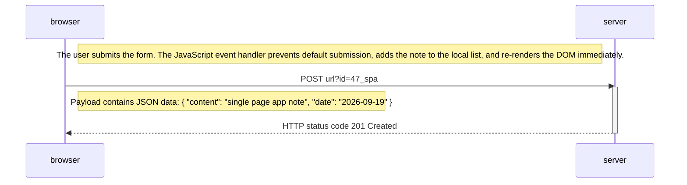

```mermaid
sequenceDiagram
    participant browser
    participant server

    Note right of browser: The user submits the form. The JavaScript event handler prevents default submission, adds the note to the local list, and re-renders the DOM immediately.

    browser->>server: POST url?id=47_spa
    activate server
    Note right of browser: Payload contains JSON data: { "content": "single page app note", "date": "2026-09-19" }
    server-->>browser: HTTP status code 201 Created
    deactivate server
```
